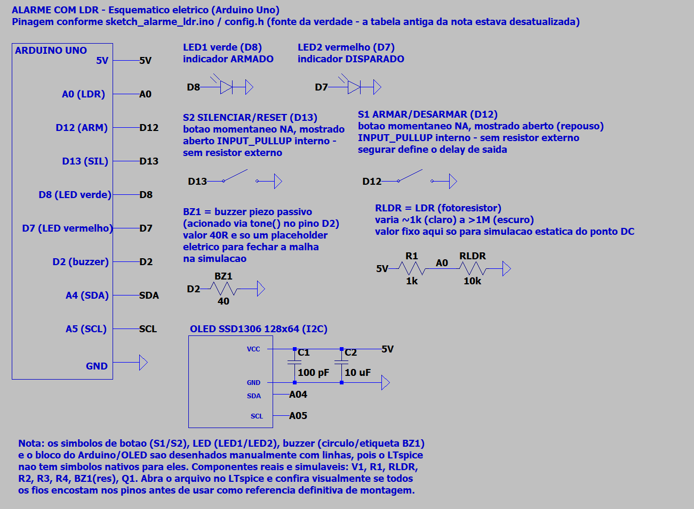

<div align="center">

# 🚨 Alarme com LDR

**Sistema de alarme com máquina de estados, delay de saída configurável por toque longo e contador de eventos persistente em EEPROM**

[](https://www.arduino.cc/)
[](https://isocpp.org/)
[](https://choosealicense.com/licenses/mit/)

</div>

---

## 📋 Descrição

O **Alarme com LDR** monitora a luminosidade ambiente via LDR (fotorresistor) e dispara um alarme sonoro/visual quando detecta uma variação abrupta de luz — abertura de uma porta, quebra de um feixe de luz, etc. O sistema é uma **máquina de estados** (`Desarmado → Configurando delay → Saindo → Armado → Disparado → Silenciado`), com um detalhe de UX pensado para o uso real: **o tempo que você segura o botão de armar define o delay de saída** — segurou pouco, sai rápido (mínimo 3s); segurou mais, tem mais tempo para sair (até 60s). Todo disparo é contado e persistido em **EEPROM**, sobrevivendo a resets e quedas de energia.

O projeto demonstra leitura analógica com calibração de baseline (em vez de um limiar fixo de luz), debounce de botões, uso de `tone()`/`noTone()` para o buzzer passivo via transistor, e escrita/leitura em EEPROM.

---

## ⚙️ Componentes Utilizados

| Quantidade | Componente | Especificação |
|:---:|---|---|
| 1x | Arduino Uno (ou compatível) | Microcontrolador ATmega328P |
| 1x | LDR (fotorresistor) | Divisor de tensão com R1, ligado ao pino A0 |
| 1x | Resistor | 10kΩ (fixo, parte do divisor de tensão do LDR) |
| 1x | Transistor NPN | Ex: BC548/2N2222 — amplifica o sinal para o buzzer |
| 1x | Buzzer piezoelétrico passivo | Acionado via `tone()` através do transistor |
| 2x | LED | Verde (armado) e vermelho (disparado) |
| 2x | Resistor | 220Ω (em série com cada LED) |
| 1x | Resistor | 1kΩ (base do transistor) |
| 2x | Push buttons | Armar/Desarmar e Silenciar/Reset (pull-up interno) |
| 1x | Display OLED 128x64 | I2C (SSD1306), pinos A4 (SDA) / A5 (SCL) |
| — | Jumper wires | Macho-macho |
| 1x | Protoboard | — |

---

## 🔌 Pinagem

```
Arduino Uno
├── A0  → Divisor de tensão do LDR (R1 10k + LDR)
├── D2  → Botão ARMAR/DESARMAR       [INPUT_PULLUP] (segurar define o delay de saída)
├── D3  → Botão SILENCIAR/RESET      [INPUT_PULLUP]
├── D6  → LED verde (sistema armado) + resistor 220Ω → GND
├── D7  → LED vermelho (disparado)   + resistor 220Ω → GND
├── D9  → Base do transistor (via resistor 1kΩ) → aciona o buzzer via tone()
├── A4  → OLED SDA
└── A5  → OLED SCL
```

**Ligação dos botões:** cada botão conecta o pino ao GND. Com `INPUT_PULLUP`, o pino lê `HIGH` em repouso e `LOW` quando pressionado.

**Divisor de tensão do LDR:** `5V → R1 (10k) → A0 → LDR → GND`. Mais luz → menor resistência do LDR → **menor** tensão/leitura em A0. Ver esquemático simulável em `Esquemático/alarme_ldr.asc` (LTspice).

**Transistor como chave para o buzzer:** o pino D9 gera o sinal PWM do `tone()` através de um resistor de base (1kΩ) até a base do transistor; o coletor aciona o buzzer (alimentado em 5V) e o emissor vai ao GND. Isso permite tocar o buzzer mais alto do que ligando-o direto num pino digital.

---

## 🖼️ Esquemático




> O arquivo `Esquemático/alarme_ldr.asc` contém o divisor de tensão do LDR simulável no LTspice — a parte analógica do circuito que se beneficia de simulação. A fiação digital (botões, LEDs, buzzer) segue o diagrama de pinagem acima.

---

## 💻 Como Funciona — Máquina de Estados

```
DESARMADO ──(segura ARMAR)──► CONFIGURANDO_DELAY ──(solta ARMAR)──► SAINDO ──(delay expira)──► ARMADO
    ▲                                                                                              │
    │                                                                            (variação de luz) │
    │                                                                                              ▼
    └──────────────(aperta ARMAR)────────── SILENCIADO ◄──(aperta SILENCIAR)────────────────  DISPARADO
                                                                                        (também sai de ARMADO
                                                                                         direto p/ DESARMADO
                                                                                         ao apertar SILENCIAR)
```

### Delay de saída configurável por toque longo

Ao segurar o botão de **armar**, o sistema entra em `CONFIGURANDO_DELAY` e a OLED mostra os segundos contados. Ao **soltar**, esse tempo segurado vira o delay de saída (limitado entre 3s e 60s):

```cpp
unsigned long tempoSegurado = millis() - inicioPressao;
delayEscolhido = constrain(tempoSegurado, DELAY_MINIMO_MS, DELAY_MAXIMO_MS);
```

### Calibração da baseline do LDR

Em vez de um limiar de luz fixo (que exigiria recalibrar o código para cada ambiente), o sistema mede a luminosidade ambiente logo antes de armar (média de 20 leituras) e usa essa média como referência:

```cpp
void calibrarBaseline() {
  long soma = 0;
  for (int i = 0; i < 20; i++) { soma += analogRead(PINO_LDR); delay(10); }
  baselineLDR = soma / 20;
}
```

O alarme dispara por **variação relativa** em torno dessa baseline (25%, com um piso mínimo absoluto para evitar falsos positivos em ambientes muito escuros):

```cpp
int diferenca = abs(analogRead(PINO_LDR) - baselineLDR);
int limiar = max((int)(baselineLDR * LIMIAR_VARIACAO), LIMIAR_MINIMO_ABSOLUTO);
return diferenca > limiar;
```

### Contador de eventos em EEPROM

Cada disparo incrementa um contador persistido na EEPROM (sobrevive a reset/desligamento):

```cpp
void registrarEvento() {
  contadorEventos++;
  EEPROM.put(ENDERECO_EEPROM_CONTADOR, contadorEventos);
}
```

### Debounce dos botões

Padrão clássico de debounce por tempo: só aceita uma leitura como estável após `DEBOUNCE_MS` sem mudança.

---

## 🗂️ Estrutura dos Arquivos

```
alarme-ldr/
├── README.md                          # Esta documentação
├── post_linkedin.txt                  # Post de divulgação do projeto
├── sketch_alarme_ldr/
│   ├── sketch_alarme_ldr.ino          # Código principal: máquina de estados e loop
│   └── config.h                       # Pinagem e parâmetros (delays, limiares, EEPROM)
├── Esquemático/
│   └── alarme_ldr.asc                 # Divisor de tensão do LDR, simulável no LTspice
└── circuit_images/
    ├── image_simulador.png            # Simulação (Wokwi/Tinkercad)
    └── Circuito_real.jpg              # Foto do circuito físico montado
```

---

## 🚀 Como Usar

1. **Monte o circuito** conforme o diagrama de pinagem acima.
2. **Instale as bibliotecas:** `Adafruit_GFX` e `Adafruit_SSD1306` (já presentes em `libraries/` no monorepo).
3. **Instale o Arduino IDE** ([download](https://www.arduino.cc/en/software)).
4. **Abra o sketch:** `sketch_alarme_ldr/sketch_alarme_ldr.ino`.
5. **Selecione a placa:** `Tools → Board → Arduino Uno`.
6. **Selecione a porta:** `Tools → Port → COMx` (Windows) ou `/dev/ttyUSBx` (Linux/Mac).
7. **Faça upload:** `Ctrl+U` ou botão Upload.
8. **Segure o botão ARMAR** pelo tempo que quiser de delay de saída, solte, e saia do ambiente antes da OLED indicar "SISTEMA ARMADO".
9. Uma variação de luz dispara o alarme; **SILENCIAR** para o som, **ARMAR** de novo para resetar e rearmar.

---

## 🔧 Personalização

- **Sensibilidade:** ajuste `LIMIAR_VARIACAO` e `LIMIAR_MINIMO_ABSOLUTO` em `config.h`.
- **Delay mínimo/máximo de saída:** ajuste `DELAY_MINIMO_MS` e `DELAY_MAXIMO_MS` em `config.h`.
- **Tom da sirene:** ajuste as frequências em `tocarSirene()` no `.ino`.
- **Zerar o contador de eventos:** grave `0` manualmente no endereço `ENDERECO_EEPROM_CONTADOR` via um sketch auxiliar de `EEPROM.put`, ou use `EEPROM.write`/`clear` conforme necessário.

> **Nota sobre EEPROM:** o Arduino Uno tem ~100.000 ciclos de escrita garantidos por célula. Como o contador só é gravado a cada disparo (não a cada loop), isso não é um problema na prática.

---

*Desenvolvido por Felipe Grolla*

